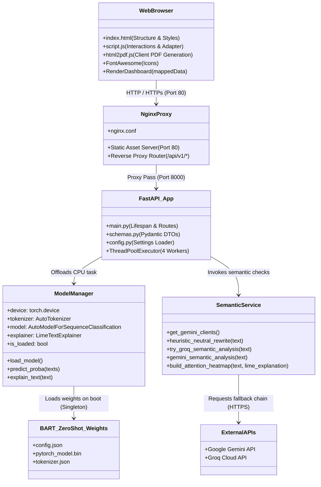
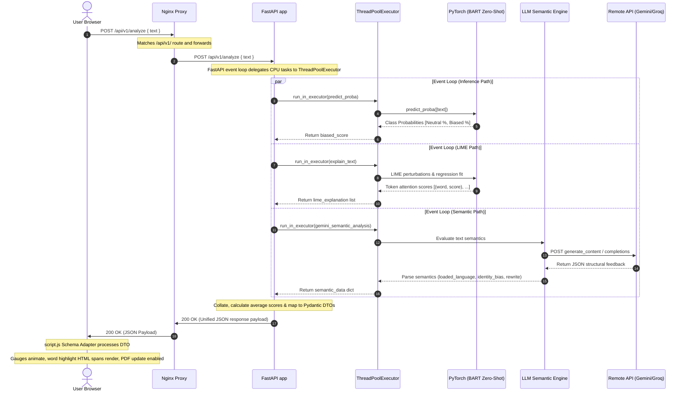
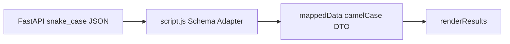
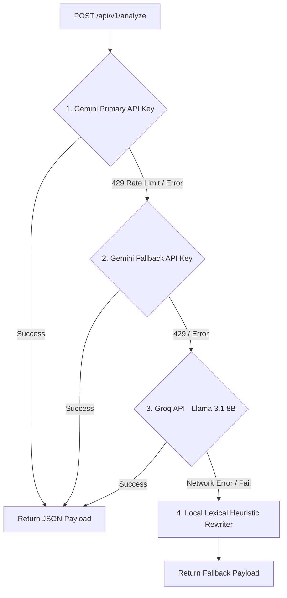

# 📘 Unbiasly AI - Comprehensive Technical Report & Architecture Specification

Unbiasly AI is a startup-grade, real-time, explainable AI bias detection engine. It combines a local deep-learning classification pipeline (**BART Zero-Shot Classifier**) for objective multi-label bias scoring, **LIME (Local Interpretable Model-agnostic Explanations)** for token-level visual attention heatmaps in sequential order, and a tiered large language model (**Google Gemini + Groq Llama 3.1**) for advanced semantic classification, contextual explanation, and neutral rewrites.

---

## 🏛️ 1. Executive System Architecture

The Unbiasly AI system is designed around a three-tier decoupled microservices architecture, orchestrated via Docker Compose and secured through a unified reverse proxy gateway.

```mermaid
graph TD
    %% Client Layer
    subgraph Client ["Client Browser Layer"]
        UI["HTML5/CSS3 Dashboard"]
        Adapter["JS Schema Adapter (script.js)"]
    end

    %% Routing / Reverse Proxy Layer
    subgraph Gateway ["Gateway & Reverse Proxy (Nginx)"]
        Proxy["Nginx Port 80"]
    end

    %% Application Layer
    subgraph Backend ["FastAPI Application (Port 8000)"]
        API["FastAPI App (main.py)"]
        Threadpool["ThreadPoolExecutor (concurrency)"]
        
        subgraph Services ["Modular Services"]
            Inference["ML Inference Service (inference.py)"]
            Semantic["LLM Semantic Service (semantic.py)"]
        end
        
        subgraph ML_Assets ["Local Models & Keys"]
            BART["BART Zero-Shot Weights"]
            GeminiAPI["Gemini API (config.py/.env)"]
        end
    end

    %% Connections
    UI -->|1. User Input| Proxy
    Proxy -->|2. Route Static Site| UI
    Proxy -->|3. Route API (/api/v1/analyze)| API
    
    API -->|4. Dispatch CPU-bound LIME| Threadpool
    Threadpool --> Inference
    Inference -->|Read weights| BART
    
    API -->|5. Asynchronous Audit| Semantic
    Semantic -->|Semantic Generation| GeminiAPI
    
    Inference -->|Probabilities & Heatmap| API
    Semantic -->|Semantics & Rewrite| API
    
    API -->|6. Unified JSON Contract| Proxy
    Proxy -->|7. API Response| Adapter
    Adapter -->|8. Mutated State| UI
```

### Architectural Design Principles
1. **Separation of Concerns (SoC)**: Presentation (HTML/JS) is fully isolated from inference logic (FastAPI/PyTorch) and web serving boundaries (Nginx).
2. **Stateless Idempotency**: The API performs evaluation on-the-fly and does not persist state. Identical input payloads yield identical outputs without side effects.
3. **Concurrency-First Routing**: Asynchronous I/O operations run concurrently with CPU-heavy tensor processing via python's threadpool bindings.
4. **Resiliency-under-Partition**: Remote API limits or hardware resource failures (such as missing GPUs or API keys) trigger automatic downgrades to mock models or local heuristics rather than crashing the system.

---

## 🧩 2. Component Diagram (CMD)

The Component Diagram represents the structural relationships, code boundaries, and dependency packages across the entire system.




### Component Details

#### A. Client Presentation Layer (`frontend/`)
*   **`index.html`**: A CSS3-styled dark-matte laboratory dashboard UI that incorporates custom container grids, animatable gauges, a theme manager, sample prompt chips, a selection Floating Action Menu (FAM), and responsive styling.
*   **`script.js`**: Orchestrates event listeners, fetches local/production API paths, handles theme caching, implements the **Presentation Schema Adapter** (translating python DTO snake_case to JS camelCase), and constructs HTML tokens for LIME highlight overlays.

#### B. Reverse Proxy Routing Layer
*   **`nginx.conf`**: Binds port 80 to server block directives. Proxies traffic matching `/api/v1/` to the backend Docker hostname `unbiasly-backend:8000`, routing all other traffic directly to static site folders. This prevents CORS pre-flight pre-processing overhead.

#### C. Backend App Core (`backend/app/`)
*   **`main.py`**: Integrates the lifespan context manager. It initializes the ML models *once* on startup (Singleton pattern) and exposes the `/api/v1/analyze` POST route. High-concurrency is achieved by delegating compute-bound operations onto a `ThreadPoolExecutor` using asyncio wrappers.
*   **`config.py`**: Reads typed configurations utilizing Pydantic's `BaseSettings`. Handles fallback key variables securely.
*   **`schemas.py`**: Declares Pydantic schemas validating input payloads and response boundaries.

#### D. Local ML Service (`backend/app/services/inference.py`)
*   **`ModelManager`**: Standardizes PyTorch execution interfaces. It detects CUDA/CPU execution devices, acts as the transformer sequence classifier loader, and instantiates the `LimeTextExplainer` class. If the model directory `./app/models/zero_shot` is unpopulated, it triggers automatic HF downloading and local caching to prevent boot loops.

#### E. Semantic Service (`backend/app/services/semantic.py`)
*   **`semantic.py`**: Houses the multi-layered remote API waterfall routing, fallback parameters, client key pooling loaders, and the local lexical text rewriter.

---

## 🔄 3. Process & Sequence Diagram (PMD)

This diagram details the chronological execution flow, showing how CPU-intensive token perturbations, tensor classification, and remote I/O API calls execute concurrently.




### Runtime Concurrency & Thread Pool Management
Because Python's standard `asyncio` is single-threaded, running CPU-bound jobs (like LIME, which creates thousands of text permutations and runs regression fits on them) directly in an `async def` route blocks the event loop. While that request is being calculated, no other HTTP requests can be accepted.

To solve this, Unbiasly offloads these CPU-bound steps onto worker threads via a `ThreadPoolExecutor`:
```python
loop = asyncio.get_running_loop()
prediction = await loop.run_in_executor(
    executor, 
    lambda: model_manager.predict_proba([text])[0]
)
```
This leaves the main event loop completely free to accept and serve concurrent network traffic.

---

## 📡 4. REST API Contract & Specifications

### Endpoint: `POST /api/v1/analyze`
Submits raw text for bias classification, semantic assessment, and neutral rewrites.

#### Request Payload (`AnalyzeRequest`)
*   **Content-Type**: `application/json`
*   **Properties**:
    *   `text` (string, required): The content to analyze. Must be at least 1 character.

```json
{
  "text": "These people are always causing problems because their ideology is dangerous."
}
```

#### Response Payload (`AnalyzeResponse`)
*   **Content-Type**: `application/json`
*   **Structure**:

| Field | Type | Description |
|---|---|---|
| `bias_detected` | boolean | Evaluates `true` if `overall_score >= 50`. |
| `overall_score` | integer | Unified score index between `0` and `100`. |
| `risk_level` | string | Normalized categorization: `HIGH` (>=70), `MEDIUM` (40-69), or `LOW` (<40). |
| `semantic_vectors` | object | Dictionary detailing scores for 4 categories (0-100). |
| `model_interpretation` | string | Contextual explanation of detected bias patterns. |
| `attention_heatmap` | array | List of token dictionaries detailing individual bias weights. |
| `sentence_vector` | object | Dictionary mapping input segment to detected classification. |
| `neutral_rewrite` | string | An objective, academically balanced version of the input text. |

```json
{
  "bias_detected": true,
  "overall_score": 75,
  "risk_level": "HIGH",
  "semantic_vectors": {
    "loaded_language": 90,
    "identity_bias": 95,
    "emotional_framing": 90,
    "toxicity_risk": 95
  },
  "model_interpretation": "The text contains broad overgeneralizations combined with identity-based othering ('these people'). The phrasing is highly emotional rather than objective.",
  "attention_heatmap": [
    { "word": "These", "score": 0.0, "label": "neutral" },
    { "word": "people", "score": 0.0, "label": "neutral" },
    { "word": "are", "score": 0.0, "label": "neutral" },
    { "word": "always", "score": 0.0, "label": "neutral" },
    { "word": "causing", "score": 0.0, "label": "neutral" },
    { "word": "problems", "score": 0.128, "label": "highly_biased" },
    { "word": "because", "score": 0.031, "label": "suspicious" },
    { "word": "their", "score": 0.066, "label": "highly_biased" },
    { "word": "ideology", "score": 0.006, "label": "neutral" },
    { "word": "is", "score": 0.0, "label": "neutral" },
    { "word": "dangerous.", "score": 0.184, "label": "highly_biased" }
  ],
  "sentence_vector": {
    "sentence": "These people are always causing problems because their ideology is dangerous.",
    "bias_type": "IDENTITY_BIAS"
  },
  "neutral_rewrite": "Concerns have been raised regarding the potential impact and implications of certain ideologies based on specific documented issues."
}
```

---

## 📐 5. Client-Side Presentation Schema Adapter

To maintain clean separation between the backend's PEP-8 compliant database/API design (`snake_case`) and the frontend's preset rendering interfaces (`camelCase`), `script.js` contains a dynamic **Presentation Schema Adapter**.

### Data Transformation Pipeline
When the API returns a response, the adapter mutates the JSON contract before invoking the dashboard render engine:



### Heatmap Token Processing
The schema adapter processes the token array into HTML spans with inline styling, border overrides, and dynamic animation delays:
```javascript
let heatmapHTML = '';
data.attention_heatmap.forEach(item => {
    const word = item.word;
    const label = item.label;
    
    if (label === 'highly_biased' || label === 'suspicious') {
        const color = label === 'highly_biased' ? 'rose' : 'amber';
        const rgb = color === 'rose' ? '244, 63, 94' : '245, 158, 11';
        heatmapHTML += `<span class="heatmap-token bg-${color}-500/20 text-${color}-400 px-1.5 py-0.5 rounded border-b-2 border-${color}-500 font-semibold" style="box-shadow: 0 0 8px rgba(${rgb}, 0.5);">${word}</span> `;
    } else {
        heatmapHTML += `<span>${word}</span> `;
    }
});
```

---

## 🛡️ 6. Quadruple-Layered API Resiliency Engine

To guarantee the application never crashes, stalls, or displays empty screens due to internet drops, credential expirations, or API rate limits, the backend implements a **quadruple-layer waterfall model** inside `semantic.py`.



### Layer Details

1.  **Layer 1: Gemini Primary (`GEMINI_API_KEY`)**: Matches the input text against `gemini-2.5-flash` or `gemini-2.0-flash` with a strict JSON format prompt.
2.  **Layer 2: Gemini Fallback (`GEMINI_API_KEY_FALLBACK`)**: Automatically retry-loops the same models using the secondary credentials if rate limits are hit.
3.  **Layer 3: Groq Cloud API (`GROQ_API_KEY`)**: Sends request to `llama-3.1-8b-instant` via direct `urllib.request` using standard library handlers. The request sets user-agent headers to bypass scraper protections and enforces a JSON schema output.
4.  **Layer 4: Local Heuristic Lexical Rewriter**: If all remote connections fail, a local string-replacement engine swaps out biased key phrases for academic equivalents:

| Input Text Pattern | Local Substitution Word |
|---|---|
| `these people` / `These people` | `some individuals` / `Some individuals` |
| `always` / `Always` | `frequently` / `Frequently` |
| `never` / `Never` | `rarely` / `Rarely` |
| `dangerous` / `Dangerous` | `assertive` / `Assertive` |
| `manipulates` / `Manipulates` | `influences` / `Influences` |
| `ruining` / `Ruining` | `impacting` / `Impacting` |
| `ideology` / `Ideology` | `perspective` / `Perspective` |
| `causing problems` | `raising discussions` |

---

## 🤖 7. BART Zero-Shot + LIME ML Pipeline

The heart of Unbiasly AI's local bias scoring consists of a PyTorch sequence classifier, zero-shot inference pipelines, and Local Interpretable Model-agnostic Explanations (LIME).

### 1. Base Classifier
*   **Model**: `facebook/bart-large-mnli` (407 million parameters).
*   **Zero-Shot Setup**: Evaluates inputs against the labels `["neutral", "biased", "toxicity", "insult"]` dynamically with `multi_label=True`.
*   **Order Realignment**: Maps model classifications back to a fixed array (`neutral`, `biased`, `toxicity`, `insult`) so the frontend gets consistent mappings.
*   **Overall Score Calculation**: Directly uses the maximum score of the non-neutral categories (`biased`, `toxicity`, `insult`), rounded and clamped between `0` and `100`.

### 2. Model-Agnostic Explainability (LIME)
LIME explains predictions by treating the transformer as a black box and observing how perturbations change model outputs:
1.  **Dynamic Explanatory Target**: LIME is dynamically targeted to explain the specific non-neutral label that received the highest classification probability for the input sentence, ensuring the heatmap represents the exact risk detected.
2.  **Perturbation**: Input text is split into tokens. LIME creates a "neighborhood" of 10 text variations by randomly turning off (masking) different tokens.
3.  **Probability Mapping**: All perturbed texts are passed through `predict_proba` in a batch to get bias probability scores.
4.  **Weighted Linear Regression**: A localized linear regression model is fit to these predictions, weighting samples higher if they are more similar to the original text.
5.  **Sequential Word Re-mapping**: LIME's coefficients (token weights) are mapped back to the original tokens in their original sentence sequence. This prevents scrambled rendering in the client dashboard.

> [!NOTE]
> To prevent PyTorch weights from bloating server memory, `ModelManager` operates as a **Singleton**. The model is instantiated and loaded once during Uvicorn startup (configured in FastAPI's `lifespan` handler), ensuring that VRAM footprint remains steady.

---

## 🎨 8. User Experience (UX) & Client Interactions

Unbiasly AI's interface is built around custom-themed interactive elements designed for a laboratory-grade aesthetic.

```
+-------------------------------------------------------------------+
|  [🔬 UNBIASLY AI]                                     [Theme]     |
|                                                                   |
|  +-------------------------------------------------------------+  |
|  |  Enter analysis payload...                                  |  |
|  |  "The media always manipulates public perception..."        |  |
|  |                                                 106 chars   |  |
|  +-------------------------------------------------------------+  |
|  [ Reset ]                                          [ Analyze ]   |
|                                                                   |
|  +-------------------------------------------------------------+  |
|  |  Active Loading: "Scanning emotionally charged language..." |  |
|  |  [===============>-----------------------] 45%              |  |
|  +-------------------------------------------------------------+  |
+-------------------------------------------------------------------+
```

### 1. Step-by-Step Loading Pipeline
When a user clicks "Analyze", the script coordinates a sequential state-revealing progress animation:
*   **0% - 25%**: "Analyzing semantic intent..."
*   **25% - 50%**: "Scanning emotionally charged language..."
*   **50% - 75%**: "Checking identity-sensitive framing..."
*   **75% - 100%**: "Generating explainability vectors..."

### 2. Floating Action Menu (FAM)
Selecting text inside the input area triggers a context-aware FAM that floats next to the selection:
*   Allows users to trigger sub-scans (`scan`, `explain`, `neutralize`) on specific phrases.
*   Displays customized progress toast notifications with dynamic FontAwesome icons (e.g., `fa-radar` with spin animations).

### 3. PDF Report Export (html2pdf.js)
Clicking the export button compiles the results panel (`#pdfContainer`) into a downloadable PDF:
*   **Clean Print Styling**: Automatically toggles the display state of copy buttons and interactive page headers before generation to ensure no UI clutter appears in the PDF layout.
*   **Theme Matching**: Checks light/dark modes dynamically to set the canvas background color (`#020617` or `#F8FAFC`), ensuring high contrast output regardless of the client's current theme.

---

## 📦 9. Infrastructure & Deployment (Docker Compose)

Unbiasly AI runs containerized in a two-service stack behind a private network bridge.

```yaml
version: '3.8'

services:
  frontend:
    image: nginx:alpine
    container_name: unbiasly-frontend
    ports:
      - "80:80"
    volumes:
      - ./frontend:/usr/share/nginx/html:ro
      - ./nginx.conf:/etc/nginx/conf.d/default.conf:ro
    depends_on:
      - backend

  backend:
    build:
      context: ./backend
      dockerfile: Dockerfile
    container_name: unbiasly-backend
    ports:
      - "8000:8000"
    volumes:
      - ./backend/app/models/zero_shot:/app/app/models/zero_shot
      - ./backend/.env:/app/.env:ro
    deploy:
      resources:
        limits:
          cpus: '2.0'
          memory: 3G
```

### Key Deployment Optimizations
*   **Decoupled Heavy Model Weights**: The 1.6GB+ model weights folder is bind-mounted (`./backend/app/models/zero_shot`) from the host rather than copied into the Docker image. This keeps container builds fast and lightweight.
*   **Resource Constraints**: CPU usage is limited to `2.0` cores and memory to `3G`. This prevents the CPU-heavy LIME regression algorithm from hogging host resources and slowing down other system services.
*   **Multi-Stage Dockerfile Builder**: The backend uses a multi-stage Docker build. Python libraries are compiled in a `builder` container, and only the resulting wheel packages are transferred to the final minimal `python:3.10-slim` run container.
