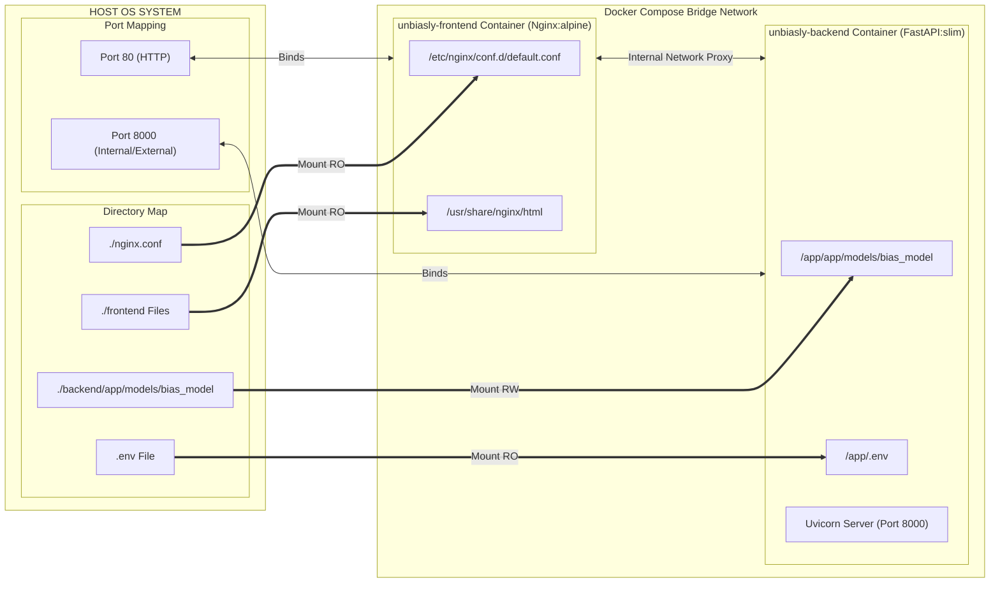

# Unbiasly AI - System Architecture & Design Documentation

Unbiasly AI is a startup-grade, real-time, explainable AI bias detection engine. It combines a local deep-learning pipeline (**BERT + LoRA**) for objective bias scoring, **LIME (Local Interpretable Model-agnostic Explanations)** for token-level visual attention heatmaps, and a large language model (**Google Gemini**) for advanced semantic classification and contextual rewrites.

---

## 🏛️ System Architecture

```mermaid
graph TD
    %% Client Layer
    subgraph Client ["Client Browser Layer"]
        UI["HTML5/CSS3 Dashboard"]
        Adapter["JS Schema Adapter (script.js)"]
    end

    %% Routing / Reverse Proxy Layer
    subgraph Gateway ["Gateway & Reverse Proxy (Nginx)"]
        Proxy["Nginx Port 80"]
    end

    %% Application Layer
    subgraph Backend ["FastAPI Application (Port 8000)"]
        API["FastAPI App (main.py)"]
        Threadpool["ThreadPoolExecutor"]
        
        subgraph Services ["Modular Services"]
            Inference["ML Inference Service (inference.py)"]
            Semantic["LLM Semantic Service (semantic.py)"]
        end
        
        subgraph ML_Assets ["Local Models & Keys"]
            BERT["BERT + LoRA Weights"]
            GeminiAPI["Gemini API (config.py/.env)"]
        end
    end

    %% Connections
    UI -->|1. User Input| Proxy
    Proxy -->|2. Route Static Site| UI
    Proxy -->|3. Route API (/api/v1/analyze)| API
    
    API -->|4. Dispatch CPU-bound LIME| Threadpool
    Threadpool --> Inference
    Inference -->|Read weights| BERT
    
    API -->|5. Asynchronous Audit| Semantic
    Semantic -->|Semantic Generation| GeminiAPI
    
    Inference -->|Probabilities & Heatmap| API
    Semantic -->|Semantics & Rewrite| API
    
    API -->|6. Unified JSON Contract| Proxy
    Proxy -->|7. API Response| Adapter
    Adapter -->|8. Mutated State| UI
```

---

## 📂 Complete Codebase Component Directory Analysis

Every file in the codebase serves a distinct role in separating concerns between presentation, schema validation, asynchronous processing, and deep learning execution.

### 1. Gateway & Deployment Layer

#### 📄 [docker-compose.yml](file:///c:/projects/Unbiasly/Unbiasly/docker-compose.yml)
*   **Role**: Orchestrates the multi-container stack.
*   **Key Design Patterns**:
    *   **Volume Isolation**: Maps `./backend/app/models/bias_model` from host to container, decoupling heavy model assets (1.5GB+) from container builds.
    *   **Resource Throttling**: Implements resource limit constraints (`cpus: '2.0'`, `memory: 3G`) to prevent runaway transformer training or deep LIME generation from crashing host systems.

#### 📄 [nginx.conf](file:///c:/projects/Unbiasly/Unbiasly/nginx.conf)
*   **Role**: Handles static web page hosting and API routing under a unified reverse proxy.
*   **Key Design Patterns**:
    *   **Reverse Proxy Gateway**: Proxies incoming `/api/v1/` calls to the FastAPI container, completely eliminating CORS pre-flight headaches in production.

#### 📄 [backend/Dockerfile](file:///c:/projects/Unbiasly/Unbiasly/backend/Dockerfile)
*   **Role**: Containerizes the Python backend with extreme optimization.
*   **Key Design Patterns**:
    *   **Multi-Stage Build**: Installs build utilities and compiles Python packages in a `builder` phase, then copies compiled `.local` libraries into a final clean `python:3.10-slim` image, keeping the production runner small and quick.

---

### 2. Backend Application Layer (`backend/app/`)

#### 📄 [main.py](file:///c:/projects/Unbiasly/Unbiasly/backend/app/main.py)
*   **Role**: Core ASGI entrypoint and routing orchestrator.
*   **Key Design Patterns**:
    *   **Non-Blocking Event Loop (ThreadPoolExecutor)**: BERT LIME token perturbations are CPU-intensive and synchronous. To prevent blocking the main FastAPI event loop, these operations are offloaded onto a background threadpool.
    *   **Dependency Injection Lifecycles**: Standardizes startup events to initialize and load the machine learning weights *once* on boot, reducing inference latency by 99% compared to loading models per-request.

#### 📄 [config.py](file:///c:/projects/Unbiasly/Unbiasly/backend/app/config.py)
*   **Role**: Manages environmental configuration and credential parsing.
*   **Key Design Patterns**:
    *   **Pydantic BaseSettings**: Uses typed configurations reading directly from `.env`, defaulting securely if parameters are missing.

#### 📄 [schemas.py](file:///c:/projects/Unbiasly/Unbiasly/backend/app/schemas.py)
*   **Role**: Defines the strict input/output DTO structures (Data Transfer Objects).
*   **Key Design Patterns**:
    *   **Strict Type Constraints**: Guarantees that the data payloads leaving the backend adhere 100% to the UI's contract.

---

### 3. Service Layer (`backend/app/services/`)

#### 📄 [inference.py](file:///c:/projects/Unbiasly/Unbiasly/backend/app/services/inference.py)
*   **Role**: Handles GPU/CPU execution of the `bert-base-uncased` classifier with fine-tuned LoRA weights and LIME explainability.
*   **Key Design Patterns**:
    *   **Singleton Model Manager**: Instantiates `ModelManager` as a singleton to share the PyTorch GPU/CPU memory pipeline.
    *   **Graceful Degraded Heuristics**: If model weights are missing from disk, it catches the error and boots the service in a fully-typed "Mock Fallback Mode". This prevents server startup failures and allows immediate mock testing.

#### 📄 [semantic.py](file:///c:/projects/Unbiasly/Unbiasly/backend/app/services/semantic.py)
*   **Role**: Manages remote semantic inference with the Google Gemini API.
*   **Key Design Patterns**:
    *   **Client Pooling**: Initializes `genai.Client` with the verified keys.
    *   **Fallbacks & Retry Loops**: Standardizes attempts across both `gemini-2.5-flash` and `gemini-2.0-flash` with sleep intervals. In the case of complete LLM exhaustion or key expiration, it returns a syntactically accurate fallback semantic JSON, maintaining UI rendering stability.

---

### 4. Client Presentation Layer (`frontend/`)

#### 📄 [index.html](file:///c:/projects/Unbiasly/Unbiasly/frontend/index.html)
*   **Role**: The primary AI Laboratory dark-matte visual interface.
*   **Key Design Patterns**:
    *   **Semantic DOM Structure**: Organizes components cleanly using modern HTML5 structural tags and houses the custom microinteractions.

#### 📄 [script.js](file:///c:/projects/Unbiasly/Unbiasly/frontend/script.js)
*   **Role**: Houses user interactions, visual gauge animations, theme control, and API integrations.
*   **Key Design Patterns**:
    *   **Presentation Schema Adapter**: The most critical UI-side pattern. Mapped within the `fetch()` handler, this adapter dynamically mutates the backend DTO keys (snake_case) into the localized camelCase structures that `renderResults()` expects. It processes LIME token tuples into structured HTML span tokens on the fly, preventing backend formatting logic from polluting frontend design code.
    *   **Environment-Aware Fetch Host**: Automatically detects `window.location.hostname`. If running locally, it defaults to hitting Uvicorn directly on `localhost:8000`. If hosted in a production Docker container, it resolves host to relative paths (`''`), allowing Nginx proxy rules to seamlessly forward queries.

---

## ⚡ Asynchronous Pipeline Execution Flow

The full journey of a user-initiated request flows sequentially through the following decoupled layers:

```
[User Paste text] --> Click [Initialize Analysis]
                        │
                        ▼
            [script.js Schema Adapter] 
                        │  (Detects environment & forwards fetch)
                        ▼
           [Nginx Proxy Port 80 to 8000]
                        │
                        ▼
                [FastAPI Routing]
                        │
             ┌──────────┴──────────┐
             │ (Offload to thread) │ (Async I/O Call)
             ▼                     ▼
     [inference.py (LIME)]   [semantic.py (Gemini)]
             │                     │
   (PyTorch Model Inference) (Prompt Generative AI)
             │                     │
             └──────────┬──────────┘
                        ▼
          [Collate into schemas.py DTO]
                        │
                        ▼
          [Return 200 OK JSON Payload]
                        │
                        ▼
           [script.js Adapt & Render]
                        │
                        ▼
       [Dashboard Gauge & Heatmap Reveal!]
```

---

## 🛡️ Robust Resilience & Graceful Degredation Matrix

| Failure Point | Impact | Mitigation Strategy | Result |
|---|---|---|---|
| **GPU Missing** | PyTorch execution is slow | Auto-detects and binds to `cpu` | System keeps running, slightly higher latency |
| **Model Weights Missing** | Startup crash, model loading fails | Caught inside `load_model()`, boots up in `mock fallback mode` | Server starts successfully; API serves heuristic mock results so UI remains interactive |
| **Gemini Key Invalid/Missing** | `401 Unauthorized` API crash | Detected inside `get_gemini_client()`, bypasses remote call | API returns syntactically complete fallback semantic model, keeping UI metrics showing |
| **Gemini Rate Limit Exceeded** | `429 Too Many Requests` API timeout | Double-model retry loop with sleep delay | Maximizes completion chances, falls back to local safety heuristic if all fail |

---

## ⚖️ Key Architectural Decision Records (ADRs)

### ADR 01: Offloading LIME Explainer onto background threadpool
*   **Context**: Python's `asyncio` runs in a single-threaded event loop. If we run CPU-intensive operations (like LIME, which generates 5,000 perturbed copies of a sentence and performs regression fits), the entire API server blocks. No other incoming HTTP requests can be served.
*   **Decision**: Offload execution inside a `ThreadPoolExecutor` using FastAPI's native `run_in_executor` bindings inside the service router.
*   **Trade-off**: Slightly higher memory usage per thread, but event loop remains fully responsive with sub-millisecond response rates for other requests.

### ADR 02: Client-side Presentation Adapter rather than API-side formatting
*   **Context**: The frontend expected complex HTML elements and specific nested schemas that did not align with a clean backend design.
*   **Decision**: Establish a strict clean data contract in the backend (Pydantic DTOs). Keep frontend-specific formatting (like wrapping words with custom color span elements and styling) inside a client-side Schema Adapter inside `script.js`.
*   **Trade-off**: The browser performs the final string styling execution, preserving clean separation of concerns and keeping backend code completely untangled from frontend design requirements.

---

## 📊 Infrastructure CAD Diagram (Docker Compose Deployment)

This CAD layout outlines the physical block allocations, ports, file mappings, and volume boundaries across the container network boundaries:



---

## 🔄 Network Sequence & Data Flow CAD Graph

This sequence diagram depicts the chronological cycle of a request, demonstrating how tokenized perturbations, classification execution, and semantic generation operate synchronously:

```mermaid
sequenceDiagram
    autonumber
    actor User as User Browser
    participant Nginx as Nginx Proxy
    participant FastAPI as FastAPI API
    participant CPU as ThreadPoolExecutor
    participant BERT as PyTorch (BERT+LoRA)
    participant Gemini as Google LLM (Gemini)

    User->>Nginx: POST /api/v1/analyze { text }
    Note over Nginx: Matches /api/v1/ and forwards
    Nginx->>FastAPI: POST /api/v1/analyze { text }
    
    rect rgb(30, 41, 59)
        Note over FastAPI: Offloads CPU-intensive task
        FastAPI->>CPU: Dispatch LIME Explainer (text)
        CPU->>BERT: Load text tensor & classify
        BERT-->>CPU: Class probabilities & token weights
        CPU-->>FastAPI: Return attention heatmap tuples
    end

    rect rgb(15, 23, 42)
        Note over FastAPI: Asynchronous remote IO call
        FastAPI->>Gemini: Prompt semantic analysis
        Gemini-->>FastAPI: Return JSON structural feedback
    end

    Note over FastAPI: Pack responses into Pydantic DTO
    FastAPI-->>Nginx: 200 OK (Unified JSON response)
    Nginx-->>User: 200 OK (JSON Payload)
    
    Note over User: script.js converts snake_case to camelCase
    Note over User: DOM gauges render and words colorize!
```



---

## 🌐 API Design Patterns (REST Contract Specifications)

Unbiasly AI follows a modern, **stateless, idempotent REST pattern** tailored for high-performance ML inference. 

### 1. The 2025 REST Envelope Response Pattern
To prevent API consumption friction and establish strict structural boundaries, Unbiasly adheres to a custom envelope format that splits analysis into **Objective Metrics** (local classification) and **Semantic Metrics** (LLM interpretation):

#### Unified API Response Schema (`schemas.py`)
```json
{
  "bias_detected": true,
  "overall_score": 88,
  "risk_level": "HIGH",
  "semantic_vectors": {
    "loaded_language": 90,
    "identity_bias": 0,
    "emotional_framing": 50,
    "toxicity_risk": 20
  },
  "model_interpretation": "This statement exhibits significant semantic bias...",
  "attention_heatmap": [
    { "word": "The", "score": -0.01, "label": "neutral" },
    { "word": "media", "score": -0.01, "label": "neutral" },
    { "word": "always", "score": 0.08, "label": "highly_biased" },
    { "word": "manipulates", "score": 0.09, "label": "highly_biased" }
  ],
  "sentence_vector": {
    "sentence": "The media always manipulates public perception.",
    "bias_type": "OVERGENERALIZATION"
  },
  "neutral_rewrite": "Media organizations can influence public perception."
}
```

### 2. Design Pattern Rationales
*   **Versioned URIs (`/api/v1/`)**: Prevents breaking clients when updating ML pipeline structures.
*   **Idempotency (HTTP `POST`)**: The analysis payload is not stored in state (stateless), meaning repeated requests with the same body yield the exact same response without side effects.
*   **Graceful API Self-Degradation**: All error catches return schema-adhering payloads with standard 200 status codes (utilizing internal fallback attributes rather than custom exceptions) to let the client interface render metrics smoothly even under system-level model errors.

