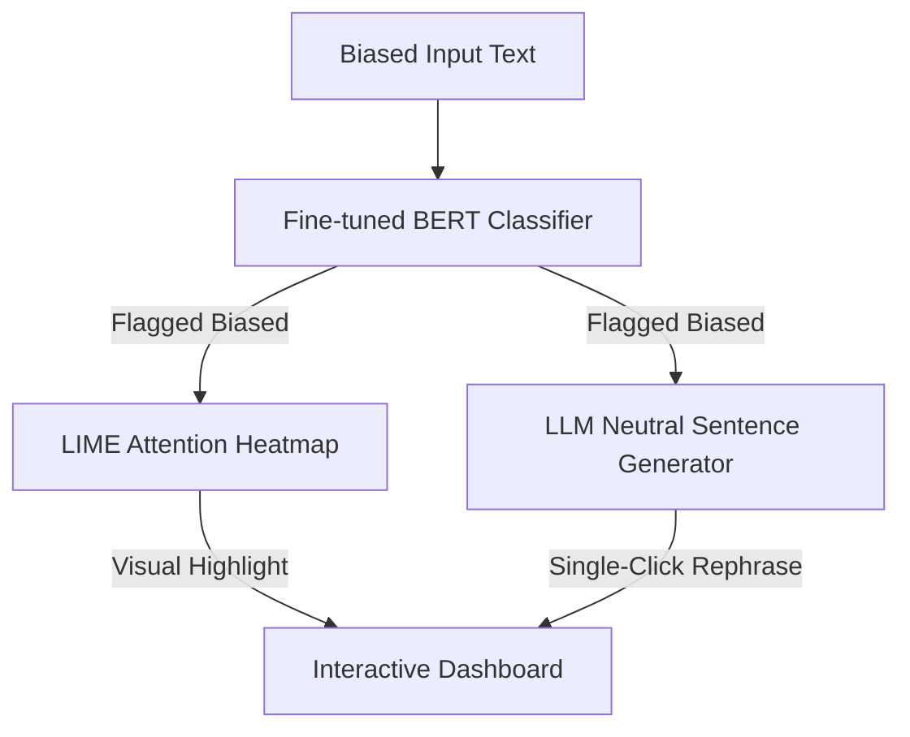

# 🎯 Unbiasly AI - Core Use Cases & Target Domains

Unbiasly AI is a production-ready, state-of-the-art bias detection and mitigation platform. By combining **local deep learning (BERT + LoRA fine-tuning)**, **explainable AI (LIME token perturbation)**, and **large language model reasoning (Gemini & Groq)**, the system helps organizations identify, explain, and neutralize bias in written content.

---

## 🏛️ Target Business Domains

### 1. Media, Journalism, and Publishing
- **Problem**: News organizations face growing skepticism regarding editorial objectivity. Unintentional framing, loaded language, and overgeneralizations can alienate readers.
- **Use Case**: Editors use Unbiasly AI as a pre-publication linting tool.
- **Impact**: Detects loaded phrasing, offers balanced revisions, and displays exactly which words trigger biased classifications to ensure high editorial compliance before articles go live.

### 2. Corporate communications & HR
- **Problem**: Internal announcements, public statements, and job descriptions can contain subtle demographic, cultural, or emotional biases that damage employer branding.
- **Use Case**: HR and PR teams run statements through the pipeline.
- **Impact**: Sanitizes communications by suggesting objective phrasing, protecting corporate identity and promoting inclusivity.

### 3. Legal and Regulatory Compliance
- **Problem**: Bias in legal texts, compliance filings, or policy briefs can introduce legal liabilities.
- **Use Case**: Legal auditors scan regulatory and policy drafts.
- **Impact**: Provides transparent audit reports explaining exactly why sentences are flagged (via LIME explainability metrics) to ensure maximum compliance.

### 4. Academic and Scientific Research
- **Problem**: Scientific reporting requires absolute emotional detachment and objective framing, which human researchers sometimes compromise.
- **Use Case**: Peer reviewers and researchers scan manuscripts before submission.
- **Impact**: Flags emotional vocabulary and frames them into neutral assertions.

---

## 👥 Core User Personas

| Persona | Role | Core Need | Key Feature Used |
|---------|------|-----------|------------------|
| **Elena Vance** | Managing Editor | Wants to ensure articles are balanced and objective under tight deadlines. | **Neutral Sentence Rewriter** (Instant, high-context rephrasing) |
| **Dr. Marcus Chen** | Data Scientist | Needs to audit why the deep learning system flagged a paragraph. | **LIME Attention Heatmap** (Sub-word level interpretability weights) |
| **Sarah Jenkins** | HR Director | Needs to draft highly inclusive internal policies without corporate bias. | **Bias Metric Gauges** (Loaded Language & Identity Bias meters) |

---

## ⚡ Real-World Flow Example

### Input Sample:
> *"These people are always causing problems because their ideology is dangerous."*

### Analysis Output:
- **BERT + LoRA Decision**: `BIASED` (Confidence: 96%)
- **LIME Heatmap Trigger Words**: `"These people"` (Identity Bias), `"always"` (Overgeneralization), `"dangerous"` (Toxicity).
- **Quadruple Fallback Rephrase**: `"Some individuals are frequently raising discussions because their perspective is considered controversial."`
